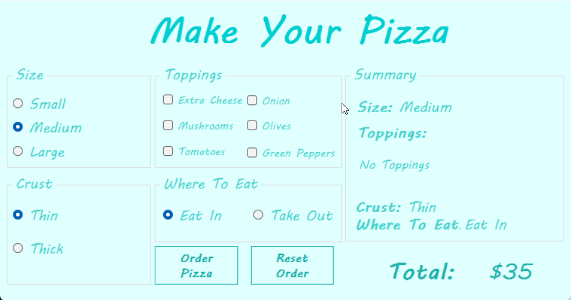

# 🍕 Mini Pizza Order Application (C# WinForms)

A desktop application designed for ordering pizzas and automatically calculating prices in real-time, built using **C#** and **Windows Forms**.

This project features an intuitive user interface (UI) and a clean code architecture focused on the **Single Responsibility Principle (SRP)**, modular helper functions, and state management using **Enums**.

---

## 📸 Application Preview

---

## ✨ Features

- **Real-Time Price Calculation:** Updates the total price and order summary instantly whenever any option is changed.
- **Pizza Size Selection:** Dynamic pricing for Small, Medium, and Large options.
- **Crust Type:** Options for Thin or Thick crust.
- **Toppings:** Selection for Extra Cheese, Mushrooms, Tomatoes, Onions, Olives, and Green Peppers.
- **Dining Option:** Toggle between Eat In and Take Out.
- **Order Summary:** Displays an organized breakdown of selected options and the final bill.
- **Reset Functionality:** Restores all options to their default state with a single click.

---

## 🛠️ Code Architecture & Best Practices

The application was built with maintainability and readability in mind:

1. **State Management via Enums:** Strongly-typed `enum` definitions for sizes, crusts, dining options, and toppings eliminate magic numbers and raw string dependencies.
2. **Functional Decomposition (Clean Abstraction Layers):**
   - **High-Level Orchestrators:** Functions like `UpdateSummary()` and `ResetOrder()` manage overall application flow.
   - **Low-Level Helpers:** Small, dedicated functions handle single tasks (e.g., computing toppings cost or updating specific summary labels).
3. **DRY Principle (Don't Repeat Yourself):** Iterates through control groups dynamically (using `foreach` loops) rather than writing repetitive manual checks.

---

## 💻 Tech Stack

* **Language:** C#
* **Framework:** .NET / Windows Forms (WinForms)
* **IDE:** Visual Studio

---

## 🚀 How to Run

1. Clone the repository:
   git clone https://github.com/your-username/mini-pizza-order.git
2. Open the solution file (*.sln) in Visual Studio.
3. Press F5 or click Start to build and run the application.

---

👨‍💻 **Developer:** Muhammad Shihab Al-Din Abdul Majid
